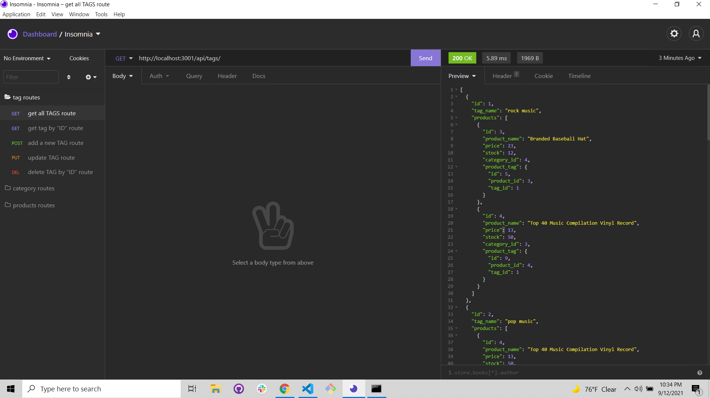
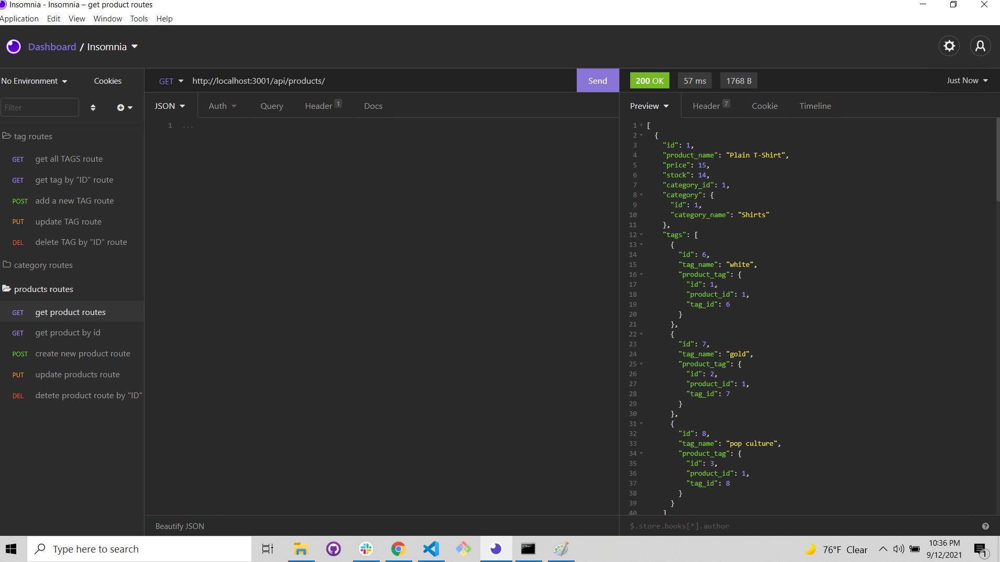
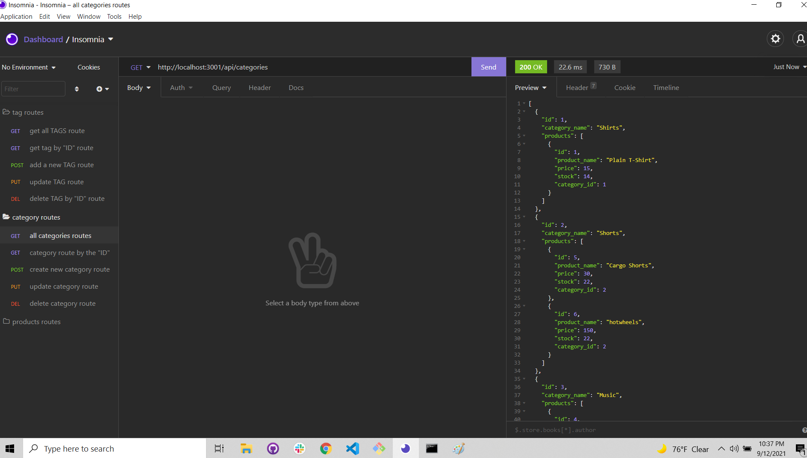
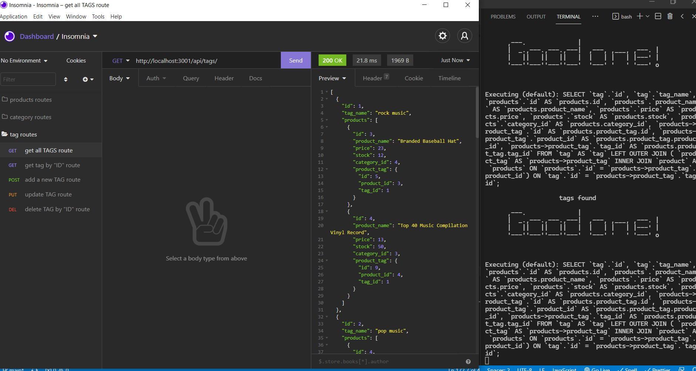

  
   
  
  

  
  <h1>  Object Relational Mapping (ORM)  </h1>
  <h2>E-commerce Back End</h2>

   
   
   
  
  <a href="#about"><strong>Explore the screenshots »</strong></a>
   
   
  
  

  
  
  
  

   
  
  
    
  

  
   
  
  

  
Table of Contents

  
  - [About](#about)
  - [Built With](#built-with)
  - [Installation](#installation)
  - [Authors & contributors](#authors--contributors)
  - [Acknowledgements](#Acknowledgements)
  - [License](#License) 
  
  
  
  
   
  
  ## About
  ---

   

  Hi everyone this is a ecommerce API with efew routes to help you get start , I already seeded the Db just to show how everything work , hopw this give a head start.
  
   
   

  

  
Usage Screenshots and Demo

    
  
   
   
   
  
   
   
  
    
   
  

   
   

  please to watch the A walkthrough video demonstrating the functionality of the application. <a href= "https://www.awesomescreenshot.com/video/5198646?key=d462621e857dedbab74c52a9be87a53a">click here </a>
  
  

  
   
   
  
  
  ## Built With
  ---

   

 
 >*  <a href="https://developer.mozilla.org/en-US/docs/Mozilla/Add-ons/WebExtensions/API">JavaScript</a>
 >*  <a href="https://nodejs.org/en/">Node</a>
  >*  <a href="https://www.tutorialspoint.com/nodejs/nodejs_express_framework.htm">express</a>
 >*  <a href="https://www.w3schools.com/js/js_es6.asp">ES6</a>
 >*  <a href="https://www.npmjs.com/package/mysql2">Node MySQL 2</a>
 >*  <a href="https://sequelize.org/v3/">Sequelize</a>
 >*  <a href="https://www.npmjs.com/package/nodemon">Nodemon</a>
 >*  <a href="https://www.npmjs.com/package/dotenv">dotenv</a>

  
  
   
   
  
  ##  Installation
  ---

   
  
   1. Install node js <a href="https://nodejs.org/en/"> [ HERE ]</a>. 
   2. Install all Dependency .
   3. Or type npm i inside your terminal.   
   3. Clone this https://github.com/mejialaguna/commerce.git .
   4. Run node seeds to start and after npm start inside your terminal. 
   5. check all the routes using <a href="https://insomnia.rest/download" > Insomnia </a> or <a href="https://www.postman.com/">postman</a> testing API program
   7. Enjoy.

   
   
  
  
  ##  Authors & contributors
  ---

   
   
  Jose Luis Mejia Laguna.
  
   
   
  
  ## Acknowledgements
  ---

   

  First off , thanks for taking the time to check out my app! , contribution are what make this open-source community such an amazing place to learn , inspire and create. Any contribution you make will benefit everyone interested in using the app and are very appriciated.
  ---

   
   
  
  ## License
  ---
   

  

   

  
  
  <a href="https://github.com/mejialaguna/commerce/issues/1">For any Question and to point out a bug please click here...</a>
